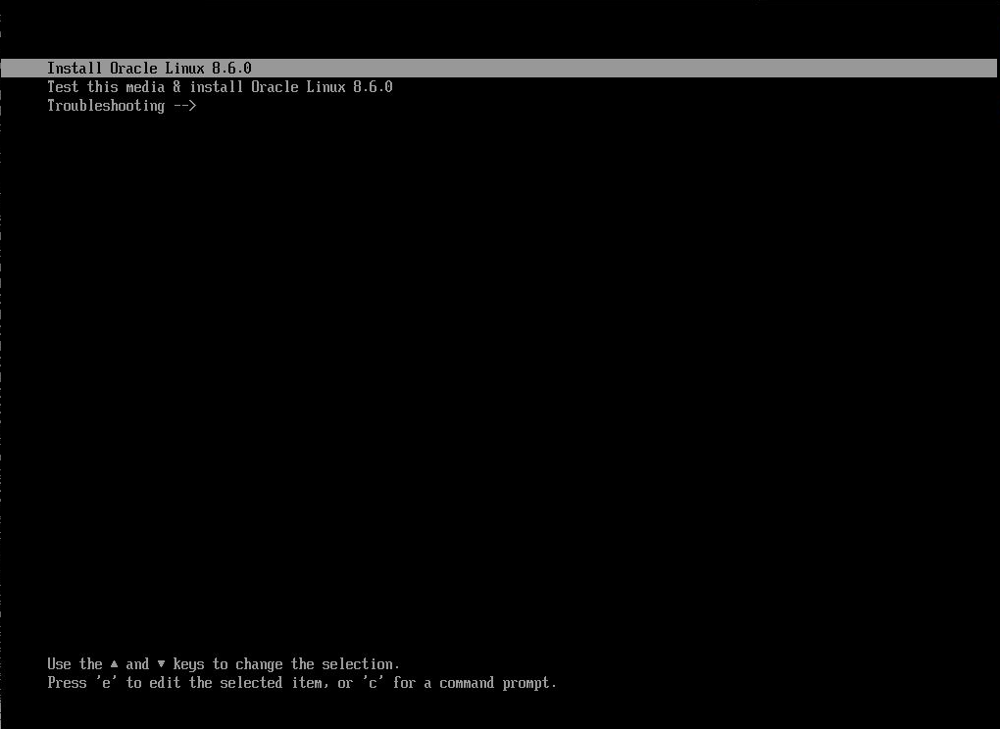
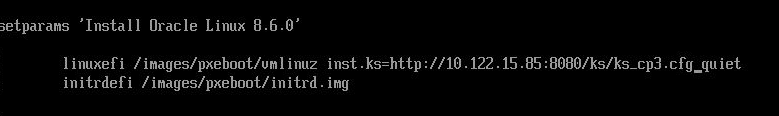

Phase2から実施。

基本的には（https://github.com/oracle-cne/ocne/blob/main/doc/experimental/phase2/phase2.md）に従う。

# 各ノードの役割
- oscip081: オペレーターノード。基本的にはここで操作を行う。
- oscip085: リポジトリをホストするノード。OSTreeのアーカイブを含んだnginxコンテナを起動するノード。また、kickstartファイルやIgnitionファイルも同コンテナでホストする。
- x6-2-04: アップグレード対処のベアメタルサーバ。

# 注意点
今回の検証環境では、プライベートコンテナレジストリをポート443で公開していないため、内部的にコンテナイメージをプルするコマンドである`ocne cluster console`コマンドを利用できない。`ocne cluster console`は、対象ノードでコマンドを実行する為のコマンドなので、今回は直接対象ノードにSSHしてコマンドを実行することで問題を回避する。

# OCK 2.*アップグレード手順
## 準備
### 1
OCKイメージを作成する。ここでは`ocne image create`コマンドで作成済みのイメージを利用。

### 2
ターゲットノードのネットワークインターフェースの情報を確認しておく。
```
[root@x6-2-04 ~]# ip a
1: lo: <LOOPBACK,UP,LOWER_UP> mtu 65536 qdisc noqueue state UNKNOWN group default qlen 1000
    link/loopback 00:00:00:00:00:00 brd 00:00:00:00:00:00
    inet 127.0.0.1/8 scope host lo
       valid_lft forever preferred_lft forever
    inet6 ::1/128 scope host 
       valid_lft forever preferred_lft forever
2: eno1: <BROADCAST,MULTICAST,UP,LOWER_UP> mtu 1500 qdisc mq state UP group default qlen 1000
    link/ether 00:10:e0:c1:bf:cc brd ff:ff:ff:ff:ff:ff
    inet 10.122.9.14/21 brd 10.122.15.255 scope global noprefixroute eno1
       valid_lft forever preferred_lft forever
    inet6 fe80::210:e0ff:fec1:bfcc/64 scope link 
       valid_lft forever preferred_lft forever
3: eno2: <NO-CARRIER,BROADCAST,MULTICAST,UP> mtu 1500 qdisc mq state DOWN group default qlen 1000
    link/ether 00:10:e0:c1:bf:cd brd ff:ff:ff:ff:ff:ff
4: eno3: <NO-CARRIER,BROADCAST,MULTICAST,UP> mtu 1500 qdisc mq state DOWN group default qlen 1000
    link/ether 00:10:e0:c1:bf:ce brd ff:ff:ff:ff:ff:ff
5: eno4: <BROADCAST,MULTICAST,UP,LOWER_UP> mtu 1500 qdisc mq state UP group default qlen 1000
    link/ether 00:10:e0:c1:bf:cf brd ff:ff:ff:ff:ff:ff
    inet 192.168.9.12/24 brd 192.168.9.255 scope global noprefixroute eno4
       valid_lft forever preferred_lft forever
    inet6 fe80::210:e0ff:fec1:bfcf/64 scope link 
       valid_lft forever preferred_lft forever

```
今回は`eno1`を利用する。

### 3
OCNE構成ファイルをオペレーターノードの`~/.ocne/byo.yaml`として作成する。(暫定)
``` yaml
provider: byo
name: ocne1x
kubernetesVersion: 1.26
loadBalancer: 10.122.15.86
providers:
  byo:
    networkInterface: eno1
password: iEa2Nhvu4.uUI
extraIgnitionInline: |
  variant: fcos
  version: 1.5.0
  passwd:
    users:
      - name: "docomo"
        password_hash: iEa2Nhvu4.uUI
        uid: 30000
        home_dir: "/home/docomo"
  storage:
    files:
      - path: /var/helloworld
        overwrite: true
        contents:
          inline: Hello, world!
        mode: 0644
      - path: /etc/hostname
        overwrite: true
        mode: 0644
        contents:
          inline: oscip084.jp.osc.oracle.com
      - path: /etc/NetworkManager/system-connections/enp3s0.nmconnection
        mode: 0600
        contents:
          inline: |
            [connection]
            id=Wired Connection
            type=ethernet
            interface-name=enp3s0
            [ipv4]
            address1=10.122.9.14/22,10.122.8.1
            dns=10.115.208.42;
            dns-search=
            may-fail=false
            method=manual
      - path: /etc/containers/registries.conf
        mode: 0644
        contents:
          inline: |
            [[registry]]
            location = "10.122.15.85:5000"
            insecure = true

            short-name-mode = "permissive"
```
ロードバランサのIPやノードのネットワークインターフェースはアップグレード対象の環境に応じて書き換える必要がある。

### 4
既存の1.xクラスターからkubeconfigを取得し、`~/.kube/kubeconfig.<CLUSTER_NAME>`にコピーする。

### 5
`kubectl get nodes`コマンドを実行し、対象のノード名を取得する。今回は`x6-2-04.jp.osc.oracle.com`を対象とする。
```
[root@oscip081 ~]# kubectl get nodes
NAME                         STATUS                        ROLES           AGE   VERSION
oscip082.jp.osc.oracle.com   Ready                         control-plane   39d   v1.26.15+1.el8
oscip083.jp.osc.oracle.com   Ready                         control-plane   39d   v1.26.15+1.el8
oscip084.jp.osc.oracle.com   Ready                         control-plane   39d   v1.26.15+1.el8
x6-2-02.jp.osc.oracle.com    Ready                         <none>          39d   v1.26.15+1.el8
x6-2-03.jp.osc.oracle.com    Ready                         <none>          39d   v1.26.15+1.el8
x6-2-04.jp.osc.oracle.com    Ready                         <none>          39d   v1.26.15+1.el8
[root@oscip081 ~]# TARGET_NODE=x6-2-04.jp.osc.oracle.com
```

### 6
対象ノードをドレインする。
```
[root@oscip081 ~]# kubectl drain --ignore-daemonsets $TARGET_NODE
```

### 7
対象ノードをリセットする。OSC環境では`ocne cluster console`コマンドが利用できないため、直接対象ノードにSSH接続してコマンドを実行する。
```
[root@oscip081 ~]# ssh root@x6-2-04
[root@x6-2-04 ~]# kubeadm reset -f
```
対象ノードがNotReadyになっていることを確認する。
```
[root@oscip081 ~]# kubectl get nodes
NAME                         STATUS                        ROLES           AGE   VERSION
oscip082.jp.osc.oracle.com   Ready                         control-plane   33d   v1.26.15+1.el8
oscip083.jp.osc.oracle.com   Ready                         control-plane   33d   v1.26.15+1.el8
oscip084.jp.osc.oracle.com   Ready                         control-plane   33d   v1.26.15+1.el8
x6-2-02.jp.osc.oracle.com    Ready                         <none>          33d   v1.26.15+1.el8
x6-2-03.jp.osc.oracle.com    Ready                         <none>          33d   v1.26.15+1.el8
x6-2-04.jp.osc.oracle.com    NotReady,SchedulingDisabled   <none>          33d   v1.26.15+1.el8
```

### 8
ターゲットノードをシャットダウンする。

```
[root@x6-2-04 ~]# shutdown -h now
```

### 9
Ignitionファイルを生成し、生成したIgnitionファイルを配布するwebサーバのホスト（ここではoscip085）にコピーしておく。
```
[root@oscip081 ~]# ocne cluster join -c ~/.ocne/byo.yaml -k ~/kubeconfig.oscjpenv.oscjpcluster -w 1 > worker-3.ign
Run these commands before booting the new node to allow it to join the cluster:
	kubeadm token create i7zn0u.u2wkh7s50y4zlf13
[root@oscip081 ~]# scp worker-3.ign root@oscip085:/root/ostree-repo
```

### 10
前述のとおり、OSC環境では`ocne cluster console`コマンドは利用できないため、ノードにログインして直接指示のコマンドを実行する。今回は`oscip083.jp.osc.oracle.com'にログインして実行する（oscip083はコントロールプレーンのひとつ）。
```
[root@oscip081 ~]# ssh root@oscip083
[root@oscip083 ~]# kubeadm token create i7zn0u.u2wkh7s50y4zlf13
i7zn0u.u2wkh7s50y4zlf13
```

### 11
kickstart構成ファイルをoscip085の`/root/ostree-repo/ks.cfg`として作成する。この時のネットワーク関連の情報も手順２で作成した`byo.yaml`と同様にする。
```
logging

keyboard us
lang en_US.UTF-8
timezone UTC
text
reboot

selinux --permissive
firewall --use-system-defaults
network --bootproto=static --device=eno1 --ip=10.122.9.14 --netmask=255.255.248.0 --gateway=10.122.8.1 --nameserver=10.115.208.42 --hostname=x6-2-04 --onboot=on --activate

zerombr
clearpart --all --initlabel
part /boot --fstype=xfs --label=boot --size=1024
part /boot/efi --fstype=efi --label=efi --size=512
part / --fstype=xfs --label=root --grow 

user --name=ocne --groups=wheel --password=welcome

services --enabled=ostree-remount

bootloader --append "rw ip=10.122.9.14::10.122.8.1:255.255.248.0:oscip084:eno1:none rd.neednet=1 ignition.platform.id=metal ignition.config.url=http://10.122.15.85:8080/ks/worker-3.ign ignition.firstboot=1"

ostreesetup --nogpg --osname ock --url http://10.122.15.85:8080/ostree --ref ock

%post

%end
```

### 12
OSTreeアーカイブをホストするコンテナを起動する。

`ocne image create`コマンドで作成されたコンテナイメージは、OSTreeアーカイブをホストする`nginx`のイメージ。ノードのアップグレードの際には、このコンテナを起動しておく必要がある。また、今回はkickstart構成ファイルとIgnition構成ファイルをこの`nginx`のコンテナでホストする。

まずは、コンテナイメージをコンテナレジストリにアップロードする。
```
[root@oscip081 images]# ocne image upload --type ostree --version 1.26 --arch amd64 --file ock-1.26-amd64-ostree.tar --destination docker://oscip085:5000/olcne/ock-ostree:1.26
Getting image source signatures
Copying blob 4e83fa4af843 skipped: already exists  
Copying blob 69eff1a7a7d6 done   | 
Copying blob 0262da94dd27 done   | 
Copying blob ef80702f36c4 done   | 
Copying blob 0f36a7d208b7 done   | 
Copying config c28dea91a8 done   | 
Writing manifest to image destination
```

次に、コンテナを起動する。コンテナの起動場所は、アップグレードするノードからアクセスできる場所ならばどこでも良い。今回はoscip085上で起動する。また、kickstart構成ファイルとIgnition構成ファイルはoscip085の`/root/ostree-repo/`配下に配置する。
```
[root@oscip085]# podman run -d -p 8080:80 -v /root/ostree-repo:/usr/share/nginx/html/ks ock-ostree:1.26
```

## アップグレード実施

マシンをOL8.6のブートイメージから起動すると、コンソールに下記のような画面が出力される。この状態で`e`キーを押し、起動パラメータを設定する。



下記のように起動パラメータを設定する。具体的に変更するのは、`inst.hd`の部分を`inst.ks=http://<kickstart構成ファイルをホストするwebサーバのIPアドレス>:8080/ks/<kickstart構成ファイル名>`とする。



変更ができたらCtrl + Xでインストールを実行する。