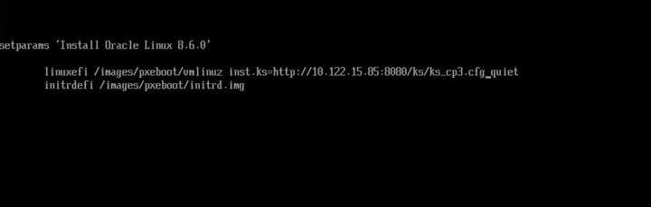

Phase2から実施。

本手順は、Phase2の中にある（https://github.com/oracle-cne/ocne/blob/main/doc/experimental/phase2/ock-upgrade.md）の部分について詳細に説明したもの。

# 注意点
今回の検証環境では、プライベートコンテナレジストリをポート443で公開していないため、内部的にコンテナイメージをプルするコマンドである`ocne cluster console`コマンドを利用できない。`ocne cluster console`は、対象ノードでコマンドを実行する為のコマンドなので、今回は直接対象ノードにSSHしてコマンドを実行することで問題を回避する。

# OCK 2.*アップグレード手順
## OCKイメージの作成
まずはOCK-forgeを使ってOCKイメージをビルドする。カスタムコンフィグのディレクトリの中の、`custom.yaml` の中にselinuxの設定が入っているとうまく動かないので、下記の二つの項目を削除する必要がある。
```
selinux=false
- ["systemd/selinux.config","/etc/selinux/config"]
```
これらを削除した結果、custom.yaml の内容は下記のようになる。
```yaml
packages:
  - autofs
  - bash-completion
  - bc
  - bind
  - cockpit
  - compat-openssl10
  - cpp
  - dnf
  - dnf-data
  - dnf-plugins-core
  - ftp
  - gcc
  - gcc-c++
  - gcc-gdb-plugin
  - gcc-plugin-annobin
  - git
  - git-core
  - git-core-doc
  - glibc-langpack-ja
  - glibc-langpack-en
  - glibc-all-langpacks
  - helm
  - hyphen
  - ipmitool.x86_64
  - langpacks-ja
  - libhugetlbfs-utils
  - make
  - net-snmp
  - nfs-utils
  - nfs4-acl-tools
  - nscd
  - oswatcher
  - passwd
  - perl
  - perl-Module-Pluggable
  - redhat-lsb-core
  - rsyslog
  - samba
  - spax
  - tcsh
  - telnet
  - telnet-server
  - traceroute
  - unzip
  - util-linux-user
  - vsftpd
  - xfsdump
  - yum
  - yum-utils
  - zip


add-files:
  - ["files/chrony.conf", "/etc/chrony.conf"]
  - ["files/sshd_config","/etc/ssh/sshd_config"]
  - ["files/sshd", "/etc/sysconfig/sshd"]
  - ["files/LOGBAK_L.sh", "/etc/tmp/LOGBAK_L.sh"]
  - ["files/ftpusers", "/etc/tmp/ftpusers"]
  - ["files/user_list", "/etc/tmp/user_list"]
  - ["files/vsftpd.conf", "/etc/tmp/vsftpd.conf"]
  - ["files/drift","/etc/tmp/drift"]
  - ["files/cron_root","/etc/tmp/cron_root"]
  - ["files/root.rhosts", "/etc/tmp/root.rhosts"]
  - ["files/known_hosts","/etc/tmp/known_hosts"]
  - ["systemd/install.service", "/usr/lib/systemd/system/install.service"]
  - ["systemd/install-pkg.sh","/etc/tmp/install-pkg.sh"]
  - ["systemd/registries.conf","/etc/tmp/registries.conf"]
  - ["files/oci-dhclient.sh", "/etc/oci-dhclient.sh"]
  - ["files/oci.sh", "/etc/dhcp/dhclient.d/oci.sh"]
  - ["files/11-dhclient", "/etc/NetworkManager/dispatcher.d/11-dhclient"]

postprocess:
  - chsh -s /bin/tcsh root
```
次に、イメージを作成する。
アーカイブを作成する際にNBDデバイスが必要になるので、下記の手順で用意する。
```
sudo modprobe nbd
lsmod | grep nbd # モジュールが正しくロードされたかを確認
ls /dev/nbd* # デバイスファイルが作成されているかを確認
```
もしやり直し等でNBDデバイスを使用してしまっている場合は、下記の手順でNBDデバイスを切断し、成果物も削除しておく。
```
qemu-nbd --disconnect /dev/nbd0
rm -rf out/1.30
```

ここまでの準備ができたら、`ock-forge`を使ってイメージを作成する。
```bash
[root@oscip087 ock-forge]# ./ock-forge -d /dev/nbd0 -D out/1.26-test/boot.qcow2 -i container-registry.oracle.com/olcne/ock-ostree:1.26 -O ./out/1.26-test/archive.tar -C ./ock -c configs/config-1.26-test -P -p file
```

成果物（`archive.tar.gz`）を`ocne image upload`コマンドでレジストリにプッシュする。
```bash
[root@oscip081 1.26-test]# ocne image upload --type ostree --file archive.tar.gz --destination docker://oscip085:5000/fujitsu/ock-ostree:1.26-test --arch amd64
```

OSTreeアーカイブをホストするコンテナイメージを作成するため、nginxを含むイメージに再ビルドする。作業ディレクトリは以下のようになっている。
```bash
[root@oscip081 images]# tree .
.
├── base_image
│   └── build
│       ├── ca-trust
│       │   ├── ca-legacy.conf
│       │   ├── ca-trust
│       │   │   ├── ca-legacy.conf
│       │   │   ├── extracted
│       │   │   │   ├── edk2
│       │   │   │   │   ├── cacerts.bin
│       │   │   │   │   └── README
│       │   │   │   ├── java
│       │   │   │   │   ├── cacerts
│       │   │   │   │   └── README
│       │   │   │   ├── openssl
│       │   │   │   │   ├── ca-bundle.trust.crt
│       │   │   │   │   └── README
│       │   │   │   ├── pem
│       │   │   │   │   ├── email-ca-bundle.pem
│       │   │   │   │   ├── objsign-ca-bundle.pem
│       │   │   │   │   ├── README
│       │   │   │   │   └── tls-ca-bundle.pem
│       │   │   │   └── README
│       │   │   ├── README
│       │   │   └── source
│       │   │       ├── anchors
│       │   │       ├── blacklist
│       │   │       ├── ca-bundle.legacy.crt
│       │   │       └── README
│       │   ├── extracted
│       │   │   ├── edk2
│       │   │   │   ├── cacerts.bin
│       │   │   │   └── README
│       │   │   ├── java
│       │   │   │   ├── cacerts
│       │   │   │   └── README
│       │   │   ├── openssl
│       │   │   │   ├── ca-bundle.trust.crt
│       │   │   │   └── README
│       │   │   ├── pem
│       │   │   │   ├── email-ca-bundle.pem
│       │   │   │   ├── objsign-ca-bundle.pem
│       │   │   │   ├── README
│       │   │   │   └── tls-ca-bundle.pem
│       │   │   └── README
│       │   ├── README
│       │   └── source
│       │       ├── anchors
│       │       ├── blacklist
│       │       ├── ca-bundle.legacy.crt
│       │       └── README
│       ├── Dockerfile
│       ├── make-archive.sh
│       ├── registries.conf
│       └── tls
│           ├── cert.pem
│           ├── certs
│           │   ├── ca-bundle.crt
│           │   └── ca-bundle.trust.crt
│           ├── ct_log_list.cnf
│           ├── misc
│           ├── openssl.cnf
│           ├── private
│           └── tls
│               ├── cert.pem
│               ├── certs
│               │   ├── ca-bundle.crt
│               │   └── ca-bundle.trust.crt
│               ├── ct_log_list.cnf
│               ├── misc
│               ├── openssl.cnf
│               └── private
└── build.tar.gz
```
`build`ディレクトリに移動し、コンテナイメージのビルドを行う。コマンドは、
```bash
[root@oscip081 build]# podman build --tls-verify=false --no-cache --isolation chroot -t <ビルドするイメージ名> --build-arg OSTREE_IMG=ostree-unverified-registry:<ocne image uploadでアップロードしたイメージ名> --build-arg PODMAN_IMG=<ocne image uploadでアップロードしたイメージ名>:<tag> --build-arg ARCH=amd64 $(pwd)
```
の形式。今回の例では下記のようになる（プロキシ経由でパッケージ等取得する関係で、プロキシ関連の環境変数を入れている）。
```bash
[root@oscip081 1.26-test]# cd base_image/build/
[root@oscip081 build]# podman build --tls-verify=false --no-cache --isolation chroot -t ock-ostree:1.26-test-nginx --build-arg OSTREE_IMG=ostree-unverified-registry:oscip085:5000/fujitsu/ock-ostree --build-arg PODMAN_IMG=oscip085:5000/fujitsu/ock-ostree:1.26-test --build-arg ARCH=amd64 --build-arg HTTP_PROXY=10.115.208.19:80 --build-arg HTTPS_PROXY=10.115.208.19:80 --build-arg NO_PROXY=oscip085 $(pwd)
```

最後に、完成したイメージをレジストリにプッシュする。
```bash
[root@oscip081 ~]# podman tag localhost/ock-ostree:1.26-test-nginx oscip085:5000/test/ock-ostree:1.26-test-nginx
[root@oscip081 ~]# podman push oscip085:5000/test/ock-ostree:1.26-test-nginx
```

## 準備

### 1
ターゲットノードのネットワークインターフェースの情報を確認しておく。
```
[root@oscip084 ~]# ip a
1: lo: <LOOPBACK,UP,LOWER_UP> mtu 65536 qdisc noqueue state UNKNOWN group default qlen 1000
    link/loopback 00:00:00:00:00:00 brd 00:00:00:00:00:00
    inet 127.0.0.1/8 scope host lo
       valid_lft forever preferred_lft forever
    inet6 ::1/128 scope host 
       valid_lft forever preferred_lft forever
2: enp3s0: <BROADCAST,MULTICAST,UP,LOWER_UP> mtu 1500 qdisc mq state UP group default qlen 1000
    link/ether 56:6f:4b:b2:00:06 brd ff:ff:ff:ff:ff:ff
    inet 10.122.15.84/21 brd 10.122.15.255 scope global noprefixroute enp3s0
       valid_lft forever preferred_lft forever
    inet6 fe80::546f:4bff:feb2:6/64 scope link noprefixroute 
       valid_lft forever preferred_lft forever
3: enp4s0: <BROADCAST,MULTICAST,UP,LOWER_UP> mtu 1500 qdisc mq state UP group default qlen 1000
    link/ether 56:6f:4b:b2:00:07 brd ff:ff:ff:ff:ff:ff
    inet 192.168.9.84/24 brd 192.168.9.255 scope global noprefixroute enp4s0
       valid_lft forever preferred_lft forever
    inet6 fe80::546f:4bff:feb2:7/64 scope link noprefixroute 
       valid_lft forever preferred_lft forever
4: flannel.1: <BROADCAST,MULTICAST,UP,LOWER_UP> mtu 1450 qdisc noqueue state UNKNOWN group default 
    link/ether 72:a4:1b:21:cf:4a brd ff:ff:ff:ff:ff:ff
    inet 10.244.3.0/32 brd 10.244.3.0 scope global flannel.1
       valid_lft forever preferred_lft forever
    inet6 fe80::70a4:1bff:fe21:cf4a/64 scope link 
       valid_lft forever preferred_lft forever
```
今回は`enp3s0`を利用する。

### 2
OCNE構成ファイルをオペレーターノードの`~/.ocne/byo_olvm.yaml`として作成する。(暫定)
``` yaml
provider: byo
name: ocne1x
kubernetesVersion: 1.26
virtualIp: <使用するコントロールプレーンのロードバランサのFQDN>
providers:
  byo:
    networkInterface: <対象ノードのネットワークインターフェース名>
password: iEa2Nhvu4.uUI
extraIgnitionInline: |
  variant: fcos
  version: 1.5.0
  passwd:
    users:
      - name: "root"
        password_hash: "<rootユーザーのパスワードハッシュ>"
        uid: 0
        home_dir: "/root"
  storage:
    files:
      - path: /etc/hostname
        overwrite: true
        mode: 0644
        contents:
          inline: <対象ノードのホスト名>
      - path: /etc/NetworkManager/system-connections/enp3s0.nmconnection
        mode: 0600
        contents:
          inline: |
            [connection]
            id=Wired Connection
            type=ethernet
            interface-name=<対象ノードのネットワークインターフェース名>
            [ipv4]
            address1=<対象ノードのIPアドレス>/<ネットワークアドレス長>,<デフォルトゲートウェイのIPアドレス>
            dns=<dnsのIPアドレス>;
            dns-search=
            may-fail=false
            method=manual
      - path: /etc/containers/registries.conf
        mode: 0644
        contents:
          inline: |
            [[registry]]
            location = "<コンテナレジストリのIPアドレス>:<コンテナレジストリのポート番号>"
            insecure = true

            short-name-mode = "permissive"
      - path: /etc/selinux/config
            overwrite: true
            mode: 0644
            contents:
              inline: |
                SELINUX=disabled
                SELINUXTYPE=targeted

```
ロードバランサのIPやノードのネットワークインターフェースはアップグレード対象の環境に応じて書き換える必要がある。
今回の手順で例を載せるノードは、
- IP: 10.122.15.84/22
- Default GW: 10.122.8.1
- DNS: 10.115.208.42
- ネットワークインターフェース名: enp3s0
- コントロールプレーンのLBのFQDN: oscip086.jp.osc.oracle.com
となっているので、下記のように書く。
```yaml
provider: byo
name: ocne1x
kubernetesVersion: 1.26
virtualIp: oscip086.jp.osc.oracle.com
providers:
  byo:
    networkInterface: enp3s0
password: iEa2Nhvu4.uUI
extraIgnitionInline: |
  variant: fcos
  version: 1.5.0
  passwd:
    users:
      - name: "root"
        password_hash: "$6$QRcEGnYoOlk8c4mY$aZZ3OY9DqOR.UxStKRrXY5trSqwFeFmRM9swKu/234FxRrgoxoyfW/cB.KJSxLnUJdbSXPsK/VQi7oINlWLSG/"
        uid: 0
        home_dir: "/root"
  storage:
    files:
      - path: /etc/hostname
        overwrite: true
        mode: 0644
        contents:
          inline: oscip084.jp.osc.oracle.com
      - path: /etc/NetworkManager/system-connections/enp3s0.nmconnection
        mode: 0600
        contents:
          inline: |
            [connection]
            id=Wired Connection
            type=ethernet
            interface-name=enp3s0
            [ipv4]
            address1=10.122.15.84/22,10.122.8.1
            dns=10.115.208.42;
            dns-search=
            may-fail=false
            method=manual
      - path: /etc/containers/registries.conf
        mode: 0644
        contents:
          inline: |
            [[registry]]
            location = "10.122.15.85:5000"
            insecure = true

            short-name-mode = "permissive"
      - path: /etc/selinux/config
        overwrite: true
        mode: 0644
        contents:
          inline: |
            SELINUX=disabled
            SELINUXTYPE=targeted
```

### 3
既存の1.xクラスターからkubeconfigを取得し、`~/.kube/kubeconfig.<CLUSTER_NAME>`にコピーする。また、ホームディレクトリにもコピーしておく。
```bash
[root@oscip081 ~]# cp kubeconfig.oscjpenv.oscjpcluster ~/.kube/kubeconfig.ocne1x 
[root@oscip081 ~]# cp kubeconfig.oscjpenv.oscjpcluster ~/kubeconfig.ocne1x # この例ではすでにホームディレクトリに存在するので、このコマンドは不要
```


### 4
`kubectl get nodes`コマンドを実行し、対象のノード名を取得する。今回は`oscip084.jp.osc.oracle.com`を対象とする。
```
[root@oscip081 ~]# kubectl get nodes
NAME                         STATUS                        ROLES           AGE   VERSION
oscip082.jp.osc.oracle.com   Ready                         control-plane   39d   v1.26.15+1.el8
oscip083.jp.osc.oracle.com   Ready                         control-plane   39d   v1.26.15+1.el8
oscip084.jp.osc.oracle.com   Ready                         control-plane   39d   v1.26.15+1.el8
x6-2-02.jp.osc.oracle.com    Ready                         <none>          39d   v1.26.15+1.el8
x6-2-03.jp.osc.oracle.com    Ready                         <none>          39d   v1.26.15+1.el8
x6-2-04.jp.osc.oracle.com    Ready                         <none>          39d   v1.26.15+1.el8
[root@oscip081 ~]# TARGET_NODE=oscip084.jp.osc.oracle.com
```

### 5
対象ノードをドレインする。
```
[root@oscip081 ~]# kubectl drain --ignore-daemonsets $TARGET_NODE
node/oscip084.jp.osc.oracle.com cordoned
Warning: ignoring DaemonSet-managed Pods: kube-system/kube-flannel-ds-cjhcg, kube-system/kube-proxy-pv2l8
node/oscip084.jp.osc.oracle.com drained
```

### 6
対象ノードをリセットする。OSC環境では`ocne cluster console`コマンドが利用できないため、直接対象ノードにSSH接続してコマンドを実行する。
```
[root@oscip081 ~]# ssh root@oscip084
[root@oscip084 ~]# kubeadm reset -f
[preflight] Running pre-flight checks
W0108 16:45:05.699751 3029049 removeetcdmember.go:106] [reset] No kubeadm config, using etcd pod spec to get data directory
[reset] Stopping the kubelet service
[reset] Unmounting mounted directories in "/var/lib/kubelet"
[reset] Deleting contents of directories: [/etc/kubernetes/manifests /var/lib/kubelet /etc/kubernetes/pki]
[reset] Deleting files: [/etc/kubernetes/admin.conf /etc/kubernetes/kubelet.conf /etc/kubernetes/bootstrap-kubelet.conf /etc/kubernetes/controller-manager.conf /etc/kubernetes/scheduler.conf]

The reset process does not clean CNI configuration. To do so, you must remove /etc/cni/net.d

The reset process does not reset or clean up iptables rules or IPVS tables.
If you wish to reset iptables, you must do so manually by using the "iptables" command.

If your cluster was setup to utilize IPVS, run ipvsadm --clear (or similar)
to reset your system's IPVS tables.

The reset process does not clean your kubeconfig files and you must remove them manually.
Please, check the contents of the $HOME/.kube/config file.
```
対象ノードがNotReadyになっていることを確認する。
```
[root@oscip081 ~]# kubectl get nodes
NAME                         STATUS                        ROLES           AGE   VERSION
oscip082.jp.osc.oracle.com   Ready                         control-plane   33d   v1.26.15+1.el8
oscip083.jp.osc.oracle.com   Ready                         control-plane   33d   v1.26.15+1.el8
oscip084.jp.osc.oracle.com   NotReady,SchedulingDisabled   control-plane   33d   v1.26.15+1.el8
x6-2-02.jp.osc.oracle.com    Ready                         <none>          33d   v1.26.15+1.el8
x6-2-03.jp.osc.oracle.com    Ready                         <none>          33d   v1.26.15+1.el8
x6-2-04.jp.osc.oracle.com    Ready                         <none>          33d   v1.26.15+1.el8
```

### 7
ターゲットノードをシャットダウンする。

```
[root@oscip084 ~]# shutdown -h now
```

### 8
下記のコマンドでIgnitionファイルを生成し、生成したIgnitionファイルを配布するwebサーバのホストにコピーしておく。
```bash
ocne cluster join -c <OCNE構成ファイルのパス> -k <kubeconfigのパス> -n 1 > <任意のIgnitionファイル名>
```
注意点として、kubeconfigはホームディレクトリに置いたものを指定する。今回の例では下の様なコマンドになる。
```
[root@oscip081 ~]# ocne cluster join -c ~/.ocne/byo_olvm.yaml -k ~/kubeconfig.oscjpenv.oscjpcluster -n 1 > control-plane-3.ign
Run these commands before booting the new node to allow it to join the cluster:
	echo "chroot /hostroot kubeadm init phase upload-certs --certificate-key ea1c0d3489a6683bf1c33e06c444527db80ee2326f97957470e039668745d4b3 --upload-certs" | ocne cluster console --node oscip083.jp.osc.oracle.com
	kubeadm token create i7zn0u.u2wkh7s50y4zlf13
```

### 9
コマンドの出力にある、下記の各コマンドを実行する。
```bash
echo "chroot /hostroot kubeadm init phase upload-certs --certificate-key ea1c0d3489a6683bf1c33e06c444527db80ee2326f97957470e039668745d4b3 --upload-certs" | ocne cluster console --node oscip083.jp.osc.oracle.com
kubeadm token create i7zn0u.u2wkh7s50y4zlf13　# 他のコントロールプレーンで実行
```
OSC環境では`ocne cluster console`コマンドが利用できないため、他のコントロールプレーンに直接SSHして実行する。今回は`oscip083.jp.osc.oracle.com`で実行する。
```bash
[root@oscip081 ~]# ssh root@oscip083
[root@oscip083 ~]# kubeadm init phase upload-certs --certificate-key ea1c0d3489a6683bf1c33e06c444527db80ee2326f97957470e039668745d4b3 --upload-certs
W0108 16:54:06.321745 3029120 version.go:104] could not fetch a Kubernetes version from the internet: unable to get URL "https://dl.k8s.io/release/stable-1.txt": Get "https://dl.k8s.io/release/stable-1.txt": context deadline exceeded (Client.Timeout exceeded while awaiting headers)
W0108 16:54:06.321835 3029120 version.go:105] falling back to the local client version: v1.26.15
[upload-certs] Storing the certificates in Secret "kubeadm-certs" in the "kube-system" Namespace
[upload-certs] Using certificate key:
ea1c0d3489a6683bf1c33e06c444527db80ee2326f97957470e039668745d4b3

[root@oscip083 ~]# kubeadm token create i7zn0u.u2wkh7s50y4zlf13
i7zn0u.u2wkh7s50y4zlf13
```

### 10
OSTreeアーカイブをホストするコンテナを起動する。

OSTreeイメージ作成手順で作成されたコンテナイメージは、OSTreeアーカイブをホストするnginxのイメージ。ノードのアップグレードの際には、このコンテナを起動しておく必要がある。また、今回はkickstart構成ファイルとIgnition構成ファイルをこのnginxのコンテナでホストする。

まずは、コンテナを起動する。コンテナの起動場所は、アップグレードするノードからアクセスできる場所ならばどこでも良い。下記の様なコマンドで起動する。

```bash
podman run -d -p 8080:80 -v <kickstart, Ignitionファイルを配置するパス>:/usr/share/nginx/html/ks <nginxを含むように再ビルドしたイメージ名>
```
今回はoscip085上で起動する。また、kickstart構成ファイルとIgnition構成ファイルはoscip085の`/root/ostree-repo/`配下に配置する。また、nginxを含むイメージに再ビルドしたときのイメージ名は`oscip085:5000/test/ock-ostree:1.26-test-nginx`。この場合、コマンドは下記のようになる。
```bash
[root@oscip085]# podman run -d -p 8080:80 -v /root/ostree-repo:/usr/share/nginx/html/ks oscip085:5000/test/ock-ostree:1.26-test-nginx
```

### 11
次に、kickstartファイルを作成する。kickstartファイルは下記のようになる。
```
logging

keyboard us
lang en_US.UTF-8
timezone UTC
text
reboot

selinux --permissive
firewall --use-system-defaults
network --bootproto=static --device=eno1 --ip=<対象ノードのIP> --netmask=<対象ノードのネットマスク> --gateway=<デフォルトゲートウェイのIP> --nameserver=<DNSのIP> --hostname=<対象ノードのホスト名> --onboot=on --activate

zerombr
clearpart --all --initlabel
part /boot --fstype=xfs --label=boot --size=1024
part /boot/efi --fstype=efi --label=efi --size=512
part / --fstype=xfs --label=root --grow 

user --name=ocne --groups=wheel --password=welcome

services --enabled=ostree-remount

bootloader --append "rw ip=<対象ノードのIP>::<対象ノードのデフォルトゲートウェイのIP>:<対象ノードのネットマスク>:<対象ノード名>:<対象ノードのネットワークインターフェース名>:none rd.neednet=1 ignition.platform.id=metal ignition.config.url=http://<IgnitionファイルをホストするウェブサーバのIP>:<同ウェブサーバのポート>/ks/<作成したIgnitionファイル名> ignition.firstboot=1"

ostreesetup --nogpg --osname ock --url http://<OSTreeアーカイブサーバのIP>:<同サーバのポート>/ostree --ref ock

%post

%end
```
今回のノードの場合、kickstartファイルは以下のようになる。
```
[root@oscip085 ostree-repo]# cat ks_cp3.cfg
logging

keyboard us
lang en_US.UTF-8
timezone UTC
text
reboot

selinux --permissive
firewall --use-system-defaults
network --bootproto=static --device=eno1 --ip=10.122.15.84 --netmask=255.255.248.0 --gateway=10.122.8.1 --nameserver=10.115.208.42 --hostname=oscip084.jp.osc.oracle.com --onboot=on --activate

zerombr
clearpart --all --initlabel
part /boot --fstype=xfs --label=boot --size=1024
part /boot/efi --fstype=efi --label=efi --size=512
part / --fstype=xfs --label=root --grow 

user --name=ocne --groups=wheel --password=welcome

services --enabled=ostree-remount

bootloader --append "rw ip=10.122.15.84::10.122.8.1:255.255.248.0:oscip084:enp3s0:none rd.neednet=1 ignition.platform.id=metal ignition.config.url=http://10.122.15.85:8080/ks/control-plane-3.ign ignition.firstboot=1"

ostreesetup --nogpg --osname ock --url http://10.122.15.85:8080/ostree --ref ock

%post

%end
```
`10.122.15.85`は、nginxを含むように再ビルドしたイメージのコンテナを起動しているノードのIP。


### 12
作成したkickstart構成ファイルと、Ignition構成ファイルを、nginxコンテナにバインドしたディレクトリにコピーする。
今回はnginxコンテナにバインドしたディレクトリは`/root/ostree-repo`なので、下記のコマンドでここにコピー。
```bash
[root@oscip081 ~]# scp control-plane-3.ign root@oscip085:/root/ostree-repo
[root@oscip081 ~]# scp ks_cp3.cfg root@oscip085:/root/ostree-repo
```

## アップグレード実施
OLVMコンソール画面に行き、対象ホストの画面に移動する。


実行の横にある矢印をおして、詳細画面を出し、１回実行を選択。


ブートオプションを次のように変更。CD/DVDイメージは、`OracleLinux-R8-U6-x86_64-dvd.iso`。


OKを押して起動した後、コンソールを開く。マシンをOL8.6のブートイメージから起動すると、コンソールに下記のような画面が出力される。この状態で`e`キーを押し、起動パラメータを設定する。


下記のように起動パラメータを設定する。具体的に変更するのは、`inst.hd`の部分を`inst.ks=http://<kickstart構成ファイルをホストするwebサーバのIPアドレス>:8080/ks/<kickstart構成ファイル名>`とする。


しばらくしたらOSが起動し、OCNEの起動に失敗するが、これは内部的にcrioが必要なイメージをプルできていないために起こる。必要なイメージをノードに入って取得することで回避可能。

必要なイメージはOCK1.26においては以下の通り。
- `<レジストリ名>/olcne/coredns:v1.9.3-4`
- `<レジストリ名>/olcne/kube-apiserver:v1.26.15`
- `<レジストリ名>/olcne/kube-controller-manager:v1.26.15`
- `<レジストリ名>/olcne/kube-proxy:v1.26.15`
- `<レジストリ名>/olcne/kube-scheduler:v1.26.15`
- `<レジストリ名>/olcne/etcd:3.5.10`
- `<レジストリ名>/olcne/pause:3.9`
- `<レジストリ名>/olcne/flannel:v0.14.1-4`

今回実施した環境ではプライベートレジストリは`oscip085:5000`でホストしているため、下記のようになる。
- `oscip085:5000/olcne/coredns:v1.9.3-4`
- `oscip085:5000/olcne/kube-apiserver:v1.26.15`
- `oscip085:5000/olcne/kube-controller-manager:v1.26.15`
- `oscip085:5000/olcne/kube-proxy:v1.26.15`
- `oscip085:5000/olcne/kube-scheduler:v1.26.15`
- `oscip085:5000/olcne/etcd:3.5.10`
- `oscip085:5000/olcne/pause:3.9`
- `oscip085:5000/olcne/flannel:v0.14.1-4`

これらのイメージを、アップグレード対象のノードに入って直接プルすればよい。アップグレード対象のノードに接続後、下記のコマンドでイメージを取得する。

```bash
[root@oscip084 ~]# podman pull oscip085:5000/olcne/coredns:v1.9.3-4
[root@oscip084 ~]# podman pull oscip085:5000/olcne/kube-apiserver:v1.26.15
[root@oscip084 ~]# podman pull oscip085:5000/olcne/kube-controller-manager:v1.26.15
[root@oscip084 ~]# podman pull oscip085:5000/olcne/kube-proxy:v1.26.15
[root@oscip084 ~]# podman pull oscip085:5000/olcne/kube-scheduler:v1.26.15
[root@oscip084 ~]# podman pull oscip085:5000/olcne/etcd:3.5.10
[root@oscip084 ~]# podman pull oscip085:5000/olcne/pause:3.9
[root@oscip084 ~]# podman pull oscip085:5000/olcne/flannel:v0.14.1-4
```

全てのイメージを取得後、ocne.serviceを再起動する。
```bash
[root@oscip084 ~]# systemctl restart ocne
```

ステータスを確認してアクティブになっていればOK。
```bash
[root@oscip084 ~]# systemctl status ocne
● ocne.service - Boostrap process for OCNE
   Loaded: loaded (/usr/lib/systemd/system/ocne.service; enabled; vendor preset: enabled)
  Drop-In: /etc/systemd/system/ocne.service.d
           └─bootstrap.conf
   Active: active (exited) since Thu 2025-01-30 12:59:54 UTC; 5s ago
  Process: 20834 ExecStart=/etc/ocne/ocne.sh (code=exited, status=0/SUCCESS)
 Main PID: 20834 (code=exited, status=0/SUCCESS)
    Tasks: 0 (limit: 202935)
   Memory: 0B
   CGroup: /system.slice/ocne.service

 1月 30 12:59:54 oscip084.jp.osc.oracle.com ocne.sh[20967]: To start administering your cluster from this node, you need to run the following as a regular user:
 1月 30 12:59:54 oscip084.jp.osc.oracle.com ocne.sh[20967]:         mkdir -p $HOME/.kube
 1月 30 12:59:54 oscip084.jp.osc.oracle.com ocne.sh[20967]:         sudo cp -i /etc/kubernetes/admin.conf $HOME/.kube/config
 1月 30 12:59:54 oscip084.jp.osc.oracle.com ocne.sh[20967]:         sudo chown $(id -u):$(id -g) $HOME/.kube/config
 1月 30 12:59:54 oscip084.jp.osc.oracle.com ocne.sh[20967]: Run 'kubectl get nodes' to see this node join the cluster.
 1月 30 12:59:54 oscip084.jp.osc.oracle.com ocne.sh[20834]: + '[' -f /etc/kubernetes/admin.conf ']'
 1月 30 12:59:54 oscip084.jp.osc.oracle.com ocne.sh[20834]: + cp /etc/kubernetes/admin.conf /etc/keepalived/kubeconfig
 1月 30 12:59:54 oscip084.jp.osc.oracle.com ocne.sh[20834]: + chown keepalived_script:keepalived_script /etc/keepalived/kubeconfig
 1月 30 12:59:54 oscip084.jp.osc.oracle.com ocne.sh[20834]: + chmod 400 /etc/keepalived/kubeconfig
 1月 30 12:59:54 oscip084.jp.osc.oracle.com systemd[1]: Started Boostrap process for OCNE.
```
`kubectl get nodes`を実行すると、Readyになっているのが確認できる。
```bash
[root@oscip082 kubernetes]# kubectl get nodes
NAME                         STATUS                        ROLES           AGE    VERSION
oscip082.jp.osc.oracle.com   Ready                         control-plane   55d    v1.26.15+1.el8
oscip083.jp.osc.oracle.com   Ready                         control-plane   55d    v1.26.15+1.el8
oscip084.jp.osc.oracle.com   Ready,SchedulingDisabled      control-plane   55d    v1.26.6+1.el8
```
最後に、アップグレードしたノードをスケジュール可能にする。
```bash
[root@oscip081 ~]# kubectl uncordon oscip084.jp.osc.oracle.com 
node/oscip084.jp.osc.oracle.com uncordoned
```
下記のコマンドでスケジュール可能になっていることが確認できる。
```bash
[root@oscip081 ~]# kubectl get nodes
NAME                         STATUS                        ROLES           AGE    VERSION
oscip082.jp.osc.oracle.com   Ready                         control-plane   56d    v1.26.15+1.el8
oscip083.jp.osc.oracle.com   Ready                         control-plane   56d    v1.26.15+1.el8
oscip084.jp.osc.oracle.com   Ready                         control-plane   56d    v1.26.6+1.el8
```