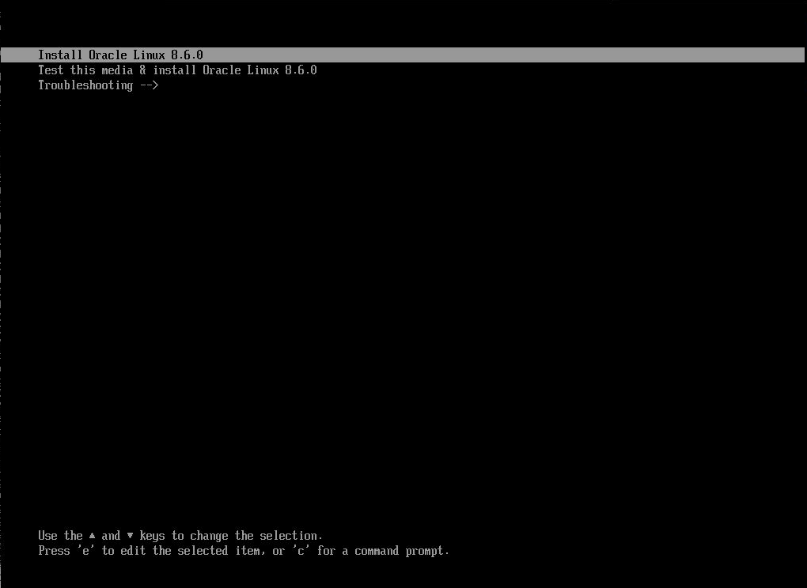
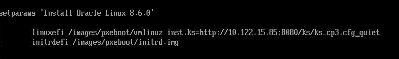

Phase2から実施。

基本的には（https://github.com/oracle-cne/ocne/blob/main/doc/experimental/phase2/phase2.md）に従う。

# 各ノードの役割
- oscip081: オペレーターノード。基本的にはここで操作を行う。
- oscip085: リポジトリをホストするノード。OSTreeのアーカイブを含んだnginxコンテナを起動するノード。また、kickstartファイルやIgnitionファイルも同コンテナでホストする。
- oscip084: アップグレード対処の仮想サーバ。

# 注意点
今回の検証環境では、プライベートコンテナレジストリをポート443で公開していないため、内部的にコンテナイメージをプルするコマンドである`ocne cluster console`コマンドを利用できない。`ocne cluster console`は、対象ノードでコマンドを実行する為のコマンドなので、今回は直接対象ノードにSSHしてコマンドを実行することで問題を回避する。

# OCK 2.*アップグレード手順
## 準備
### 1
OCKイメージを作成する。ここでは`ocne image create`コマンドで作成済みのイメージを利用。

### 2
ターゲットノードのネットワークインターフェースの情報を確認しておく。
```
[root@oscip084 ~]# ip a
1: lo: <LOOPBACK,UP,LOWER_UP> mtu 65536 qdisc noqueue state UNKNOWN group default qlen 1000
    link/loopback 00:00:00:00:00:00 brd 00:00:00:00:00:00
    inet 127.0.0.1/8 scope host lo
       valid_lft forever preferred_lft forever
    inet6 ::1/128 scope host 
       valid_lft forever preferred_lft forever
2: enp3s0: <BROADCAST,MULTICAST,UP,LOWER_UP> mtu 1500 qdisc mq state UP group default qlen 1000
    link/ether 56:6f:4b:b2:00:06 brd ff:ff:ff:ff:ff:ff
    inet 10.122.15.84/21 brd 10.122.15.255 scope global noprefixroute enp3s0
       valid_lft forever preferred_lft forever
    inet6 fe80::546f:4bff:feb2:6/64 scope link noprefixroute 
       valid_lft forever preferred_lft forever
3: enp4s0: <BROADCAST,MULTICAST,UP,LOWER_UP> mtu 1500 qdisc mq state UP group default qlen 1000
    link/ether 56:6f:4b:b2:00:07 brd ff:ff:ff:ff:ff:ff
    inet 192.168.9.84/24 brd 192.168.9.255 scope global noprefixroute enp4s0
       valid_lft forever preferred_lft forever
    inet6 fe80::546f:4bff:feb2:7/64 scope link noprefixroute 
       valid_lft forever preferred_lft forever
4: flannel.1: <BROADCAST,MULTICAST,UP,LOWER_UP> mtu 1450 qdisc noqueue state UNKNOWN group default 
    link/ether 72:a4:1b:21:cf:4a brd ff:ff:ff:ff:ff:ff
    inet 10.244.3.0/32 brd 10.244.3.0 scope global flannel.1
       valid_lft forever preferred_lft forever
    inet6 fe80::70a4:1bff:fe21:cf4a/64 scope link 
       valid_lft forever preferred_lft forever
```
今回は`enp3s0`を利用する。

### 3
OCNE構成ファイルをオペレーターノードの`~/.ocne/byo_olvm.yaml`として作成する。(暫定)
``` yaml
provider: byo
name: ocne1x
kubernetesVersion: 1.26
loadBalancer: 10.122.15.86
providers:
  byo:
    networkInterface: enp3s0
password: iEa2Nhvu4.uUI
extraIgnitionInline: |
  variant: fcos
  version: 1.5.0
  passwd:
  users:
    - name: "docomo"
      password_hash: iEa2Nhvu4.uUI
      uid: 30000
      home_dir: "/home/docomo"
  storage:
    files:
      - path: /var/helloworld
        overwrite: true
        contents:
          inline: Hello, world!
        mode: 0644
      - path: /etc/hostname
        overwrite: true
        mode: 0644
        contents:
          inline: oscip084.jp.osc.oracle.com
      - path: /etc/NetworkManager/system-connections/enp3s0.nmconnection
        mode: 0600
        contents:
          inline: |
            [connection]
            id=Wired Connection
            type=ethernet
            interface-name=enp3s0
            [ipv4]
            address1=10.122.15.84/22,10.122.8.1
            dns=10.115.208.42;
            dns-search=
            may-fail=false
            method=manual
      - path: /etc/containers/registries.conf
        mode: 0644
        contents:
          inline: |
            [[registry]]
            location = "10.122.15.85:5000"
            insecure = true

            short-name-mode = "permissive"
```
ロードバランサのIPやノードのネットワークインターフェースはアップグレード対象の環境に応じて書き換える必要がある。

### 4
既存の1.xクラスターからkubeconfigを取得し、`~/.kube/kubeconfig.<CLUSTER_NAME>`にコピーする。

### 5
`kubectl get nodes`コマンドを実行し、対象のノード名を取得する。今回は`oscip084.jp.osc.oracle.com`を対象とする。
```
[root@oscip081 ~]# kubectl get nodes
NAME                         STATUS                        ROLES           AGE   VERSION
oscip082.jp.osc.oracle.com   Ready                         control-plane   39d   v1.26.15+1.el8
oscip083.jp.osc.oracle.com   Ready                         control-plane   39d   v1.26.15+1.el8
oscip084.jp.osc.oracle.com   Ready                         control-plane   39d   v1.26.15+1.el8
x6-2-02.jp.osc.oracle.com    Ready                         <none>          39d   v1.26.15+1.el8
x6-2-03.jp.osc.oracle.com    Ready                         <none>          39d   v1.26.15+1.el8
x6-2-04.jp.osc.oracle.com    Ready                         <none>          39d   v1.26.15+1.el8
[root@oscip081 ~]# TARGET_NODE=oscip084.jp.osc.oracle.com
```

### 6
対象ノードをドレインする。
```
[root@oscip081 ~]# kubectl drain --ignore-daemonsets $TARGET_NODE
node/oscip084.jp.osc.oracle.com cordoned
Warning: ignoring DaemonSet-managed Pods: kube-system/kube-flannel-ds-cjhcg, kube-system/kube-proxy-pv2l8
node/oscip084.jp.osc.oracle.com drained
```

### 7
対象ノードをリセットする。OSC環境では`ocne cluster console`コマンドが利用できないため、直接対象ノードにSSH接続してコマンドを実行する。
```
[root@oscip081 ~]# ssh root@oscip084
[root@oscip084 ~]# kubeadm reset -f
[preflight] Running pre-flight checks
W0108 16:45:05.699751 3029049 removeetcdmember.go:106] [reset] No kubeadm config, using etcd pod spec to get data directory
[reset] Stopping the kubelet service
[reset] Unmounting mounted directories in "/var/lib/kubelet"
[reset] Deleting contents of directories: [/etc/kubernetes/manifests /var/lib/kubelet /etc/kubernetes/pki]
[reset] Deleting files: [/etc/kubernetes/admin.conf /etc/kubernetes/kubelet.conf /etc/kubernetes/bootstrap-kubelet.conf /etc/kubernetes/controller-manager.conf /etc/kubernetes/scheduler.conf]

The reset process does not clean CNI configuration. To do so, you must remove /etc/cni/net.d

The reset process does not reset or clean up iptables rules or IPVS tables.
If you wish to reset iptables, you must do so manually by using the "iptables" command.

If your cluster was setup to utilize IPVS, run ipvsadm --clear (or similar)
to reset your system's IPVS tables.

The reset process does not clean your kubeconfig files and you must remove them manually.
Please, check the contents of the $HOME/.kube/config file.
```
対象ノードがNotReadyになっていることを確認する。
```
[root@oscip081 ~]# kubectl get nodes
NAME                         STATUS                        ROLES           AGE   VERSION
oscip082.jp.osc.oracle.com   Ready                         control-plane   33d   v1.26.15+1.el8
oscip083.jp.osc.oracle.com   Ready                         control-plane   33d   v1.26.15+1.el8
oscip084.jp.osc.oracle.com   NotReady,SchedulingDisabled   control-plane   33d   v1.26.15+1.el8
x6-2-02.jp.osc.oracle.com    Ready                         <none>          33d   v1.26.15+1.el8
x6-2-03.jp.osc.oracle.com    Ready                         <none>          33d   v1.26.15+1.el8
x6-2-04.jp.osc.oracle.com    Ready                         <none>          33d   v1.26.15+1.el8
```

### 8
ターゲットノードをシャットダウンする。

```
[root@oscip084 ~]# shutdown -h now
```

### 9
Ignitionファイルを生成し、生成したIgnitionファイルを配布するwebサーバのホスト（ここではoscip085）にコピーしておく。
```
[root@oscip081 ~]# ocne cluster join -c ~/.ocne/byo_olvm.yaml -k ~/kubeconfig.oscjpenv.oscjpcluster -n 1 > control-plane-3.ign
Run these commands before booting the new node to allow it to join the cluster:
	echo "chroot /hostroot kubeadm init phase upload-certs --certificate-key ea1c0d3489a6683bf1c33e06c444527db80ee2326f97957470e039668745d4b3 --upload-certs" | ocne cluster console --node oscip083.jp.osc.oracle.com
	kubeadm token create i7zn0u.u2wkh7s50y4zlf13
[root@oscip081 ~]# scp control-plane-3.ign root@oscip085:/root/ostree-repo
```

### 10
前述のとおり、OSC環境では`ocne cluster console`コマンドは利用できないため、ノードにログインして直接指示のコマンドを実行する。今回は`oscip083.jp.osc.oracle.com'にログインして実行する。
```
[root@oscip081 ~]# ssh root@oscip083
[root@oscip083 ~]# kubeadm init phase upload-certs --certificate-key ea1c0d3489a6683bf1c33e06c444527db80ee2326f97957470e039668745d4b3 --upload-certs
W0108 16:54:06.321745 3029120 version.go:104] could not fetch a Kubernetes version from the internet: unable to get URL "https://dl.k8s.io/release/stable-1.txt": Get "https://dl.k8s.io/release/stable-1.txt": context deadline exceeded (Client.Timeout exceeded while awaiting headers)
W0108 16:54:06.321835 3029120 version.go:105] falling back to the local client version: v1.26.15
[upload-certs] Storing the certificates in Secret "kubeadm-certs" in the "kube-system" Namespace
[upload-certs] Using certificate key:
ea1c0d3489a6683bf1c33e06c444527db80ee2326f97957470e039668745d4b3

[root@oscip083 ~]# kubeadm token create i7zn0u.u2wkh7s50y4zlf13
i7zn0u.u2wkh7s50y4zlf13
```

### 11
kickstart構成ファイルをoscip085の`/root/ostree-repo/ks.cfg`として作成する。この時のネットワーク関連の情報も手順２で作成した`byo_olvm.yaml`と同様にする。
```
logging

keyboard us
lang en_US.UTF-8
timezone UTC
text
reboot

selinux --permissive
firewall --use-system-defaults
network --bootproto=static --device=eno1 --ip=10.122.15.84 --netmask=255.255.248.0 --gateway=10.122.8.1 --nameserver=10.115.208.42 --hostname=oscip084 --onboot=on --activate

zerombr
clearpart --all --initlabel
part /boot --fstype=xfs --label=boot --size=1024
part /boot/efi --fstype=efi --label=efi --size=512
part / --fstype=xfs --label=root --grow 

user --name=ocne --groups=wheel --password=welcome

services --enabled=ostree-remount

bootloader --append "rw ip=10.122.15.84::10.122.8.1:255.255.248.0:oscip084:enp3s0:none rd.neednet=1 ignition.platform.id=metal ignition.config.url=http://10.122.15.85:8080/ks/control-plane-3.ign ignition.firstboot=1"

ostreesetup --nogpg --osname ock --url http://10.122.15.85:8080/ostree --ref ock

%post

%end
```

### 12
OSTreeアーカイブをホストするコンテナを起動する。

`ocne image create`コマンドで作成されたコンテナイメージは、OSTreeアーカイブをホストする`nginx`のイメージ。ノードのアップグレードの際には、このコンテナを起動しておく必要がある。また、今回はkickstart構成ファイルとIgnition構成ファイルをこの`nginx`のコンテナでホストする。

まずは、コンテナイメージをコンテナレジストリにアップロードする。
```
[root@oscip081 images]# ocne image upload --type ostree --version 1.26 --arch amd64 --file ock-1.26-amd64-ostree.tar --destination docker://oscip085:5000/olcne/ock-ostree:1.26
Getting image source signatures
Copying blob 4e83fa4af843 skipped: already exists  
Copying blob 69eff1a7a7d6 done   | 
Copying blob 0262da94dd27 done   | 
Copying blob ef80702f36c4 done   | 
Copying blob 0f36a7d208b7 done   | 
Copying config c28dea91a8 done   | 
Writing manifest to image destination
```

次に、コンテナを起動する。コンテナの起動場所は、アップグレードするノードからアクセスできる場所ならばどこでも良い。今回はoscip085上で起動する。また、kickstart構成ファイルとIgnition構成ファイルはoscip085の`/root/ostree-repo/`配下に配置する。
```
[root@oscip085]# podman run -d -p 8080:80 -v /root/ostree-repo:/usr/share/nginx/html/ks ock-ostree:1.26
```

## アップグレード実施

マシンをOL8.6のブートイメージから起動すると、コンソールに下記のような画面が出力される。この状態で`e`キーを押し、起動パラメータを設定する。



下記のように起動パラメータを設定する。具体的に変更するのは、`inst.hd`の部分を`inst.ks=http://<kickstart構成ファイルをホストするwebサーバのIPアドレス>:8080/ks/<kickstart構成ファイル名>`とする。



変更ができたらCtrl + Xでインストールを実行する。